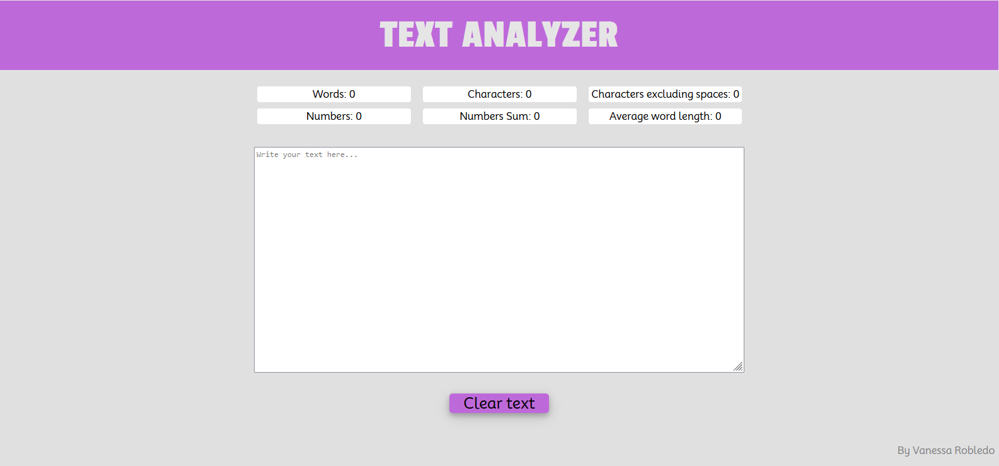

# Analizador de texto

El analizador de texto es una herramienta para poder encontrar en cualquier texto ingresado la cantidad de palabras,caracteres, caracteres sin contar los espacios, la cantidad de números, la suma de todos los números y por último la longitud promedio de las palabras ingresadas en el area de texto.

# Diseño y prototipo

Primero se realizó un prototipo de baja fidelidad para tener una idea básica del orden de los elementos, en esta etapa no se eligieron colores, ni fuentes. Se escogió un diseño minimalista, claro y facil de utilizar, evitando distracciones visuales y sobrecarga de elementos.
Se decidió solo agregar un titulo, los elementos donde se muestran los resultados y el area de texto, además de un botón que te permite limpiar el area de texto y los resultados para poder volver a usar el analizador de texto.

Luego durante el proceso de diseño se escogieron colores, gracias al feedback de distintos usuarios estos se cambiaron, tambíen se cambiaron las fuentes y el orden y tamaño de algunos elementos. Llegando al diseño del resultado final.

# Autor del proyecto

Vanessa Robledo
